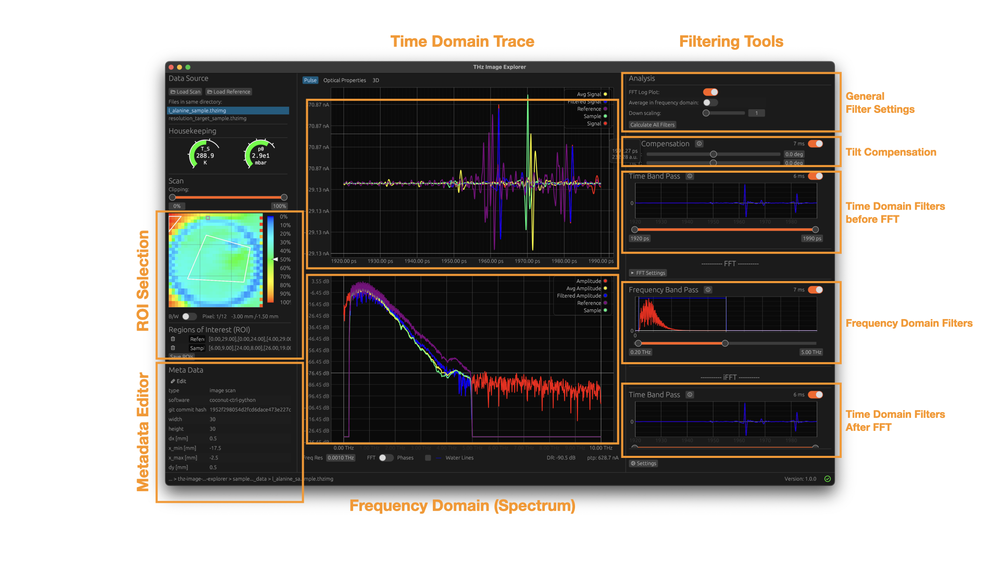
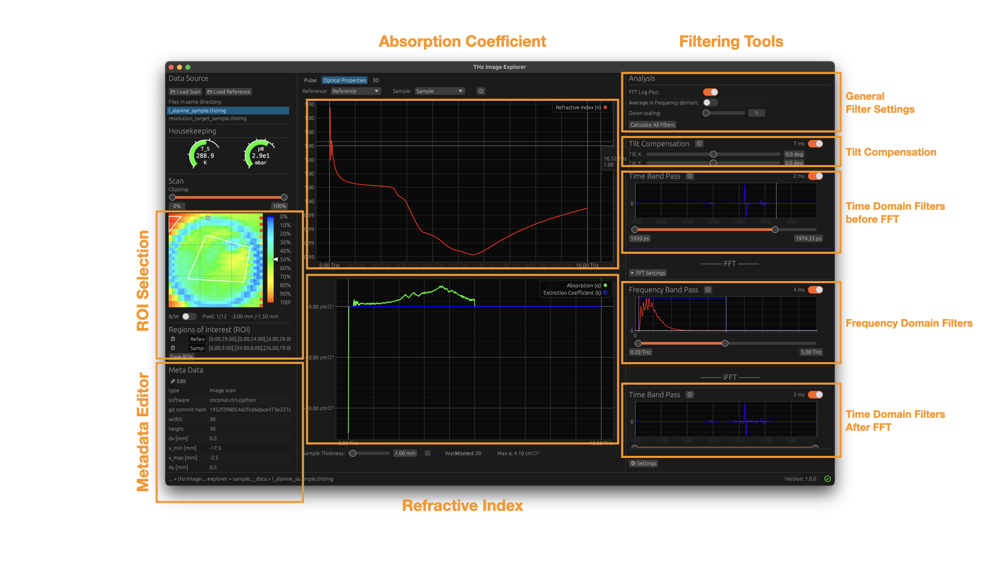

# THz Image Explorer - An Interactive Cross-Platform Open-Source THz Image Analysis Tool

[](https://joss.theoj.org/papers/690071df7fe4b9bf97a6ea20c06c0de2)
[](https://github.com/unibe-icelab/thz-image-explorer/actions/workflows/deployment.yml)
[](https://github.com/XAMPPRocky/tokei)


<a href="https://github.com/unibe-icelab/thz-image-explorer/releases"> </img> </a>

THz Image Explorer is an interactive cross-platform open-source tool for analyzing THz time-domain imaging data. Its
goal is to
make the analysis of THz scans easier and more accessible to researchers by providing a user-friendly interface and a
set of powerful features.
This Application is written in Rust and the GUI is based on egui and bevy.

<p align="center">
  
  
</p>

Sample scans of a THz time-domain 2D imaging system can be found in the `sample_data` directory. The `reference.thz`
corresponds to the `l_alanine_sample.thzimg` file.

---

## Table of Contents

- [Features](#features)
- [Installation](#installation)
    - [Download Pre-built Executables](#download-pre-built-executables)
    - [Compile from Source](#compile-from-source)
- [Usage](#usage)
- [Custom Filters](#custom-filters)
- [PSF File Generation](#psf-file-generation)
- [Tested Platforms](#tested-platforms)
- [Community Guidelines](#community-guidelines)

---

## Features

- Cross-platform (Linux, macOS, Windows)
- Interactive 2D and 3D visualization
- Meta data editing
- Region of Interest (ROI) selection and comparison
- Reference dataset support
- Extensible with custom filters

---

## Installation

### Download Pre-built Executables

[Binary bundles](https://github.com/unibe-icelab/thz-image-explorer/releases) are available for Linux, macOS, and
Windows.

#### macOS

If you see the message `"THz Image Explorer is damaged and cannot be opened."`, run:

```sh
xattr -rd com.apple.quarantine THz\ Image\ Explorer.app
```

#### Linux

Install dependencies:

```sh
sudo apt-get install libxcb-render0-dev libxcb-shape0-dev libxcb-xfixes0-dev libxkbcommon-dev libssl-dev libasound2-dev libxkbcommon-x11-0 libx11-dev
```

---

### Compile from Source

1. Install Rust and Cargo.
2. Install Cmake.
3. Install dependencies (Linux only):
   ```sh
   sudo apt-get install libxcb-render0-dev libxcb-shape0-dev libxcb-xfixes0-dev libxkbcommon-dev libssl-dev pkg-config libx11-dev libasound2-dev libudev-dev libxkbcommon-x11-0
   ```
   Note: For Fedora and other distributions consult [bevy](https://github.com/bevyengine)
   and [egui](https://github.com/emilk/egui) documentation for the required dependencies.
4. Install bundling tools:
    - Linux/macOS: `cargo install cargo-bundle`
    - Windows: `cargo install cargo-wix`
5. Build:
    - Linux/macOS: `cargo bundle --release`
    - Windows: `cargo wix -p thz-image-explorer`

> **Note:** [cargo-bundle](https://github.com/burtonageo/cargo-bundle) only supports Linux and macOS. For Windows,
> use [cargo-wix](https://github.com/volks73/cargo-wix).

#### macOS Plugin

The `DotTHzQLExtension.appex` plugin is installed in `THz Image Explorer.app/Contents/PlugIns`.  
Source: [DotTHzQL](https://github.com/hacknus/DotTHzQL)  
Requires HDF5 to be installed system-wide.

---

## Usage

Example data is available in the `sample_data` directory of this repository.

The window is structured with the time domain trace and frequency domain spectrum for the selected pixel (default is
0,0) in the center panel. A different tab showing the optical properties (refractive index and absorption coefficient)
can be selected, as
well as a tab containing an interactive 3D viewer.
The left side-panel contains the intensity plot of the 2D scan along with the meta-data editor. The right
side-panel contains the possible filters with configuration settings.
A pixel can be (de-)selected by clicking inside the intensity plot.
For large scans, it is recommended to down-scale the image. This will average the pixel values in a $2 \times 2$
(or $4 \times 4$ and so on) pixel block, depending on the down-scaling factor. Note that the "Signal" trace in
time-domain will still show the raw trace, but the "Signal" spectrum in the FFT plot will show the averaged spectrum of
the down-scaled image.

### IO

THz Image Explorer is able to load scans in the `.thz` (dotTHz) format, which are based on the HDF5 standard.
This allows the files to also contain meta-data, which will also be displayed by the THz Image Explorer. The meta-data
is shown in the file opening dialog on Linux and Windows, and using QuickView on macOS, allowing to easily
browse through directories containing multiple scans.

THz Image Explorer supports drag & drop of `.thz`, `.thzimg` and `.thzswp` files.

To comply with the dotTHz standard, the `.thzimg` file needs to contain two datasets:

- time axis: 1D, shape `(n_t,)`
- data: 3D, shape `(n_x, n_y, n_t)`

The file should also contain at least the mandatory fields of the meta-data (e.g. user, date, thickness etc.).

The 3D structure can be exported as a `.vtu` file for further analysis.

A reference file (standard `.thz`) can be loaded, which is used to compute the optical properties of the sample. The
first
entry will be used.

### Interface

The interface is split into three main sections: Pulse View (main), Optical Properties View and 3D View.
New files can be opened either via the `Open File` Menu in the left panel or by drag & drop of `.thz` or `.thzimg`
files.
A Meta Data editor is located on the left side and a filter configuration panel on the right side. These panels are
visible in all three views.
The main view shows the time domain trace and frequency domain spectrum of the selected pixel, as well as the 2D
intensity plot of the scan. The plots can be zoomed by right-clicking and dragging a rectangle, panning can be done by
left-clicking and dragging the mouse. Double-clicking will reset the zoom and pan.

  <p align="center">
    
  </p>

The Optical Properties View shows the refractive index and absorption coefficient
calculated from the selected pixel and the reference scan (this can either be different ROIs, the selected Pixel or the
reference file).

  <p align="center">
    
  </p>

### dotTHz Meta Data Editor

The meta-data editor allows the user to edit the meta-data of the loaded scan. The meta-data is stored in the `.thz` (or
`.thzimg`, or `.thzswp`)
file. Certain fields are mandatory as per the dotTHz standard, and cannot be deleted. But any further
attributes can be added, modified and deleted.


  <p align="center">
    
  </p>

### Regions of Interest (ROI)

By holding the Shift key and selecting pixels, a
region of interest (ROI) can be selected. This ROI is a convex polygon, which is closed if the last corner is selected
reasonably close to the first one (< 5 % of width/height of the image). This ROI can then be saved in the meta-data of
the dotTHz file for future analysis. The full averaged scan as well as the averages of all selected ROIs can be
displayed in the center plot.

  <p align="center">
    
  </p>

### 3D view supports rotation and zoom:

  <p align="center">
    
  </p>

### Filtering Pipeline

The filtering process is a simple linear pipeline, where the output of one filter is the input of the next filter.
On top of the filtering pipeline/panel general settings are located:

- FFT Log Plot (default: on), which shows the frequency spectrum in logarithmic scale
- Average in Frequency domain (default: off), which averages the selected pixels (ROI) in frequency domain instead of
  time domain (after the iFFT). This is useful if averaging in time domain leads to destructive interferences.
- Downscale Factor (default: 1), which downscales the 2D image by averaging pixel blocks of size
  `Downscale Factor x Downscale Factor`

#### Time Domain Before FFT

Before applying the Fast-Fourier-Transform (FFT), a tilt-compensation can be applied to the time domain trace to
compensate any misalignment along the $x$ axis and/or $y$ axis.
Additionally, a simple band-pass filter can be applied to exclude secondary peaks.

#### FFT

To reduce artifacts in frequency domain, a window is multiplied to the time domain signal before applying the
Fast-Fourier-Transform (FFT). By default, an adapted Blackman
window is applied, but the user can also select other windows:

- Adapted Blackman (default)
- Blackman
- Hanning
- Hamming
- FlatTop

The adapted Blackman window is a modified version of the Blackman window, where most of the signal is preserved and only
the first and last couple of datapoints are modified.

All windows are defined in `math_tools.rs`.

#### Frequency Band Pass Filter

A simple band-pass filter can be applied in fourier space to only display certain frequency bands.

#### Inverse FFT

The inverse FFT is applied to convert the data from frequency domain back to time domain.

#### Time Domain After FFT

After converting back to time domain, another band-pass filter can be applied to the time traces.

#### Deconvolution

The deconvolution filter is an implementation of the Frequency-dependent Richardson-Lucy algorithm.

#### Custom Filters

Extend the codebase with custom filters:

1. Create a file in `src/filters` with a struct implementing the `Filter` trait.
2. Attach the file to `mod.rs` in `src/filters`.
3. Implement the required functions (`config`, `filter`, `ui`, etc.).
4. Derive `Clone`, `Debug`, and `CopyStaticFields`.
5. Add the `#[register_filter]` macro to your struct.

Loops requiring heavy computation can be parallelized using the `rayon` crate. Use the `cancellable_loops` crate for
abortable computations.

**Example:**

```rust
use crate::filters::filter::Filter;
use crate::data_container::ScannedImageFilterData;
use crate::gui::application::GuiSettingsContainer;

#[register_filter]
#[derive(Clone, Debug, CopyStaticFields)]
struct ExampleFilter;

impl Filter for ExampleFilter {
    fn new() -> Self { ExampleFilter }

    fn reset(&mut self, time: &Array1<f32>, shape: &[usize]) {
        // Reset any internal state if necessary
    }

    fn show_data(&mut self, data: &ScannedImageFilterData) {
        // Display any data in the GUI if needed
    }

    fn filter(
        &mut self,
        input_data: &ScannedImageFilterData,
        gui_settings: &mut GuiSettingsContainer,
        progress_lock: &mut Arc<RwLock<Option<f32>>>,
        abort_flag: &Arc<AtomicBool>,
    ) -> ScannedImageFilterData {
        // Apply filter logic here
        input_data.clone() // Placeholder, replace with actual filtering logic
    }


    fn config(&self) -> FilterConfig {
        FilterConfig {
            name: "Example Filter".to_string(),
            description: "Description of the example filter.".to_string(),
            hyperlink: None, // Optional DOI or reference link
            domain: FilterDomain::TimeBeforeFFT, // Specify the domain of the filter
        }
    }

    fn ui(
        &mut self,
        ui: &mut egui::Ui,
        thread_communication: &mut ThreadCommunication,
        panel_width: f32,
    ) -> egui::Response {
        // Render filter configuration UI here
    }
}
```

---

## PSF File Generation

To run the deconvolution filter, a point spread function (PSF) file is required.

1. Perform a knife-edge scan and create a `.thz` file (see `sample_data/example_beam_width/`).
2. Install the python dependencies in the `scripts` directory:
   ```pip install -r requirements.txt```
3. Run:

    ```shell
    python scripts/generate_psf.py \
      --path_x sample_data/example_beam_width/measurement_x/data/1750085285.8557956_data.thz \
      --path_y sample_data/example_beam_width/measurement_y/data/1750163177.929295_data.thz
      ```

This generates a `psf.npz` file for deblurring in THz Image Explorer.

---

## Further processing (with Python)

After regions of interest (ROIs) have been selected, they can be saved in the meta-data of the dotTHz file. The
coordinates are saved for each ROI with label "ROI {i}" as a list, e.g.:

```
"ROI 1": [[27.57,34.72],[37.96,23.65],[40.35,32.06],[35.06,37.92]]
```

while the label of the ROI is saved in the "ROI Labels" meta-data field as a comma-separated list.
The file can then be opened with Python using the `pydotthz` package
to further process the data.
A Python code snipped for ROI extraction and the PSF generation script can be found in the `scripts` directory of the
repository, be sure to install `shapely` for python or just run:
```pip install -r requirements.txt```

---

## Tested Platforms

- macOS 12.4 Monterey x86
- macOS 10.14.6 Mojave x86
- Debian 12 (Testing) x86
- Windows 10 x86

---

## Community Guidelines

We welcome contributions and feedback from the community! Please follow these guidelines:

1. **Contributing to the Software**
    - Fork the repository and submit pull requests for new features, bug fixes, or improvements.
    - Please ensure your code follows the existing style and includes relevant documentation.
    - For major changes, open an issue first to discuss your proposal.

2. **Reporting Issues or Problems**
    - Use the [GitHub Issues](https://github.com/unibe-icelab/thz-image-explorer/issues) page to report bugs, request
      features, or suggest improvements.
    - Provide as much detail as possible, including steps to reproduce, screenshots, and your operating system.

3. **Seeking Support**
    - For general questions or help, open a discussion in
      the [GitHub Discussions](https://github.com/unibe-icelab/thz-image-explorer/discussions) section.
    - You may also contact the maintainers via email listed in the relevant publication.

Thank you for helping us improve THz Image Explorer!
