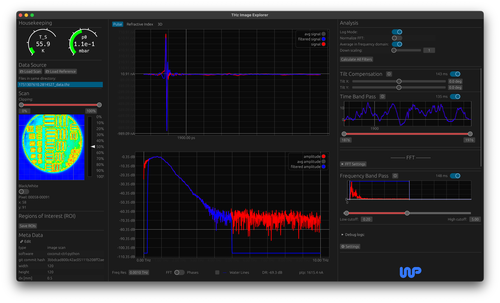
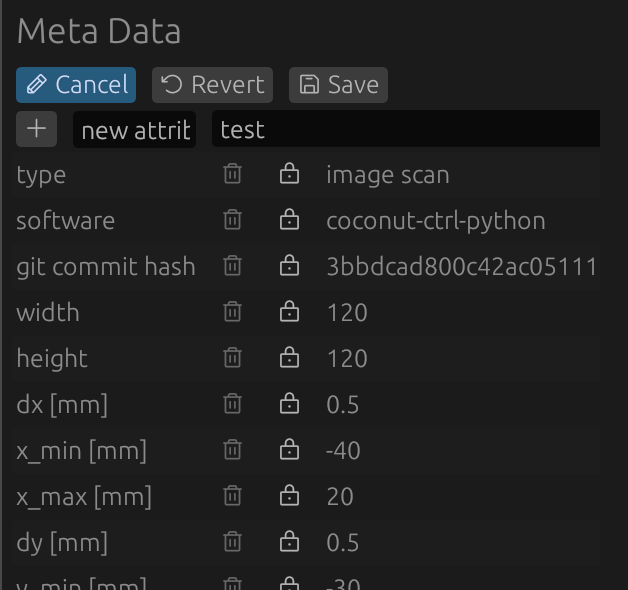
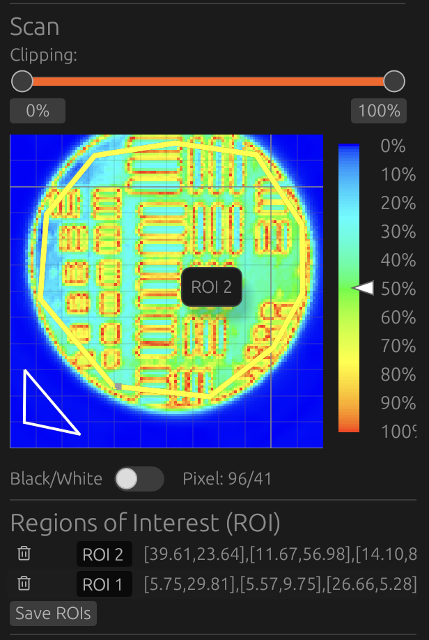
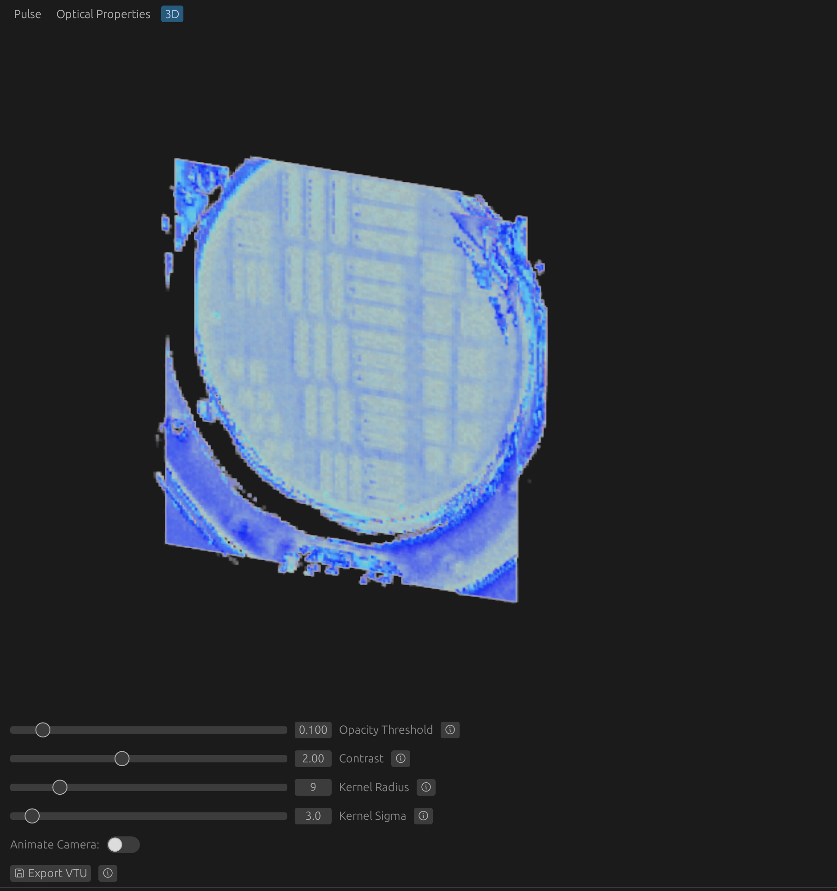

# THz Image Explorer - An Interactive Cross-Platform Open-Source THz Image Analysis Tool

<a href="https://github.com/unibe-icelab/thz-image-explorer/releases"> </img> </a>

This Application is written in Rust and the GUI is based on egui and bevy.




A sample scan of a THz time-domain 2D imaging system can be found in the `sample_data` directory.

## Installation:

### Download pre-built executables

[Binary bundles](https://github.com/unibe-icelab/thz-image-explorer/releases) are available for Linux, macOS and
Windows.

Running the Apple Silicon (thz-image-explorer-aarch64-apple-darwin.app) binary may result to the message "THz Image
Explorer is damaged and cannot be opened.", to get
around this you first need to run:
`xattr -rd com.apple.quarantine THz\ Image\ Explorer.app`

On Linux first install the following:

```sh
sudo apt-get install libxcb-render0-dev libxcb-shape0-dev libxcb-xfixes0-dev libxkbcommon-dev libssl-dev libasound2-dev
```

### Compile from source

The source code can be run using `cargo run` or bundled to a platform-executable using cargo bundle.
Currently [cargo bundle](https://github.com/burtonageo/cargo-bundle) only supports linux and macOS
bundles [see github issue](https://github.com/burtonageo/cargo-bundle/issues/77).
As a work-around we can use [cargo wix](https://github.com/volks73/cargo-wix) to create a windows installer.

On Linux first install the following:

```sh
sudo apt-get install libxcb-render0-dev libxcb-shape0-dev libxcb-xfixes0-dev libxkbcommon-dev libssl-dev libasound2-dev
```

After installing
`cargo install cargo-bundle` on linux and macOS or `cargo install cargo-wix` on windows
run
`cargo bundle` on linux and macOS or `cargo wix` on windows to create platform-executable bundles.

On macOS the `DotTHzQLExtension.appex` Plugin will automatically be installed in the
`THz Image Explorer.app/Contents/PlugIns` directory. The source code of the plugin can be
found [here](https://github.com/hacknus/DotTHzQL). Note: This plugin requires HDF5 to be installed system-wide.

It can be compiled and run on all platforms.

## Usage:

For files larger than 100 x 100 x 2000 datapoints, it is recommended to use `downscaling` to improve responsiveness.

The user can edit the meta-data of the `.thz` files in the Meta Data Editor:
<div style="text-align: center;"> </img> </div>

In the 2D view, the user can select a region of interest (ROI) to zoom in on the data.
<div style="text-align: center;"> </img> </div>

The application provides a 3D view of the data, which can be rotated and zoomed in/out.


Furthermore, a reference dataset can be loaded and the user can select a reference pulse to be used for the calculation
of the optical properties. Alternatively, different regions of interest (ROIs) can be compared.

## Custom Filters

The code-base can easily be extended with custom filters. The user needs to create a custom file in the `src/filters`
directory with a struct that implements the `Filter` trait. The file needs to be attached to the `mod.rs` file in the
`src/filters` directory, so that it is included in the compilation.
By defining the `config()` function, the user can supply a name, description and specify in which domain the filter
operates (time or frequency).
The math of the filter needs to be placed in the `filter()` function and the user-interface (UI) in the `ui()` function
the using `egui` library.
`Clone`, `Debug` and `CopyStaticFields` need to be derived.
Additionally, the `#[register_filter]` procedural macro
needs to added to the custom filter struct to automatically add it to the application and the user does not need to
adapt any other files.

Loops that require a lot of computation can be parallelized using the `rayon` crate, which is already included in the
project dependencies. It is recommended to use the  `cancellable_loops` crate to allow the user to abort long
running computations. This crate provides a convenient way to check for an abort flag and handle progress updates in the
GUI.

```rust
use crate::filters::filter::Filter;
use crate::data_container::ScannedImageFilterData;
use crate::gui::application::GuiSettingsContainer;

#[register_filter]
#[derive(Clone, Debug, CopyStaticFields)]
struct ExampleFilter;

impl Filter for ExampleFilter {
    fn new() -> Self { ExampleFilter }

    fn reset(&mut self, time: &Array1<f32>, shape: &[usize]) {
        // Reset any internal state if necessary
    }

    fn show_data(&mut self, data: &ScannedImageFilterData) {
        // Display any data in the GUI if needed
    }

    fn filter(
        &mut self,
        input_data: &ScannedImageFilterData,
        gui_settings: &mut GuiSettingsContainer,
        progress_lock: &mut Arc<RwLock<Option<f32>>>,
        abort_flag: &Arc<AtomicBool>,
    ) -> ScannedImageFilterData {
        // Apply filter logic here
        input_data.clone() // Placeholder, replace with actual filtering logic
    }


    fn config(&self) -> FilterConfig {
        FilterConfig {
            name: "Example Filter".to_string(),
            description: "Description of the example filter.".to_string(),
            hyperlink: None, // Optional DOI or reference link
            domain: FilterDomain::TimeBeforeFFT, // Specify the domain of the filter
        }
    }

    fn ui(
        &mut self,
        ui: &mut egui::Ui,
        thread_communication: &mut ThreadCommunication,
        panel_width: f32,
    ) -> egui::Response {
        // Render filter configuration UI here
    }
}
```

To implement more complex methods, further adaptations might be required, but the code structure has been set up with
modularity and simplicity in mind.

## PSF file generation:

You need to performa knife-edge scan and create a `.thz` file with all entries. An example can be found in the
`sample_data/example_beam_width/` directories.
Then, use the following command (replace the paths with your own):

```shell
python scripts/generate_psf.py \
  --path_x sample_data/example_beam_width/measurement_x/data/1750085285.8557956_data.thz \
  --path_y sample_data/example_beam_width/measurement_y/data/1750163177.929295_data.thz
```

to generate a `psf.npz` file that can be loaded in the settings of THz-image-explorer to remove the PSF blur.

Tested on:

- MacOS 12.4 Monterey x86
- MacOS 10.14.6 Mojave x86
- Debian 12 (Testing) x86
- Windows 10 x86
