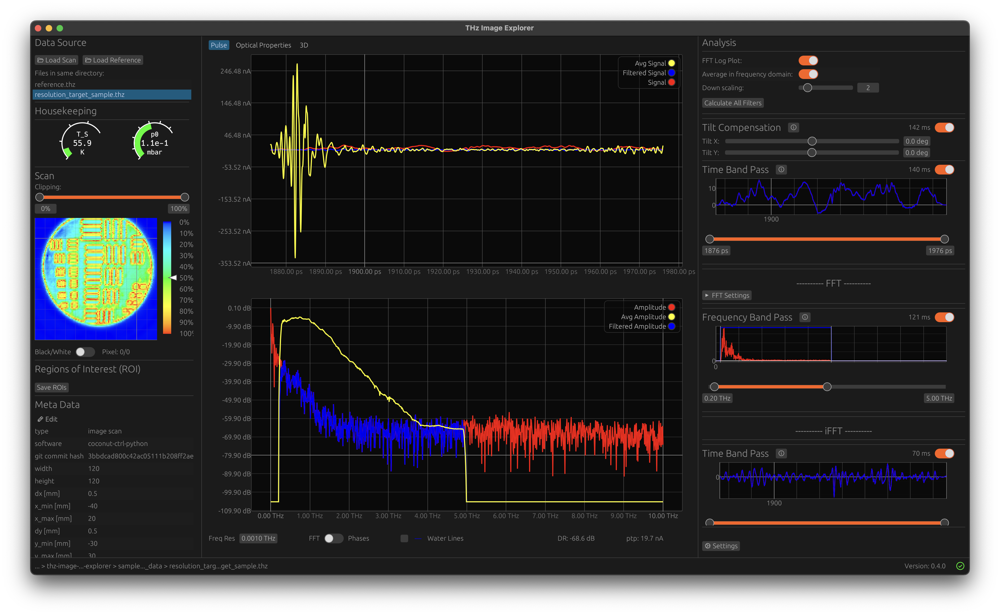
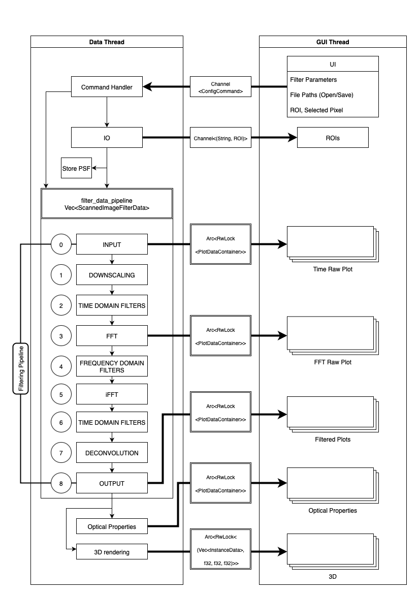

# Introduction

THz time-domain spectroscopy (TDS) is a fast-growing field with applications to perform non-destructive studies of
material properties [@neu_tutorial_2018].
This involves measuring the interaction of pulses of radiation with a sample, where the pulses are measured after either passing through (transmission spectrum) or being reflected by (reflection
spectrum) the sample. Through Fourier analysis (FFT), we can investigate the
complex refractive index and absorption coefficient of the sample.
By placing either the sample or the optical setup on a moving stage, the sample can be imaged in 2D.

{#id .class width=20%}

We developed an interactive graphical user interface (GUI), written
in [Rust](https://www.rust-lang.org) [@matsakis2014rust], to aid in investigating acquired 2D scans. The
application implements the dotTHz standard [@lee_dotthz_2023] and is platform independent and open-source, making
it easier to maintain and increasing its reach.

# Statement of need

Interactive analysis tools for THz spectroscopy are essential to browse through images and analyse different regions of
interest efficiently.
Commercial suppliers (e.g., [Menlo Systems](https://www.menlosystems.com)) provide closed-source analysis tools where the
code cannot be adapted by the user, which is often essential in research environments and can extend the maintainability of
the code.
Solutions published by the scientific community are not available on all platforms, are only applicable on single pixel
measurements, and/or are not focused on an interactive workflow [@peretti_thz-tds_2019; @loaiza_thztools_2024].
With this application, we provide a high-performance solution written in Rust that allows an interactive analysis of 2D
THz
scans with multiple filters and a 3D viewer.
The work is open-source, and pre-built bundles are provided for Linux, macOS, and Windows, ensuring broad accessibility
for the scientific community.

# Structure

The application is multithreaded with two main threads:

- GUI thread
- Data thread

The GUI uses [egui](https://www.egui.rs), an immediate-mode GUI library for Rust.

The structure of the software is shown in Figure \ref{fig:software-architecture}.

{width=80% .center}

# Usage

A sample scan (of a resolution target) is available in the `sample_data` directory. The measurement has been acquired
using the COCoNuT setup [@coconut_2025].

## Optical Properties Calculation

The user can select a source and reference scan in the drop-down menu, after which the refractive index $n$ and
absorption coefficient $\alpha$ are computed according to @Jepsen2019:
$$n(\omega) = 1 + \frac{c \Delta\phi(\omega)}{\omega d},$$
$$\alpha(\omega) = -\frac{2}{d} \ln\left(\frac{(n+1)^2}{4n} \cdot \frac{A_{\text{sample}}(\omega)}{A_{\text{reference}}(\omega)}\right),$$
where

- $\Delta\phi(\omega) = \phi_{\text{sample}}(\omega) - \phi_{\text{reference}}(\omega)$ is the phase difference
- $A_{\text{sample}}(\omega)$ and $A_{\text{reference}}(\omega)$ are the amplitude spectra
- $c$ is the speed of light
- $\omega = 2\pi f$ is the angular frequency
- $d$ is the sample thickness

## Interactive 3D Viewer

A THz time domain scan produces a 3D data array with dimensions $n_x \times n_y \times n_t$, where $(n_x, n_y)$
represent the spatial coordinates and $n_t$ represents the time axis.

Scans performed in reflection can be visualized in 3D. First, we transform each time trace into an intensity value by
computing
the squared amplitude and
applying a Gaussian envelope function
$$
I(x,y,t) = |s(x,y,t)|^2 * G_{\sigma}(t),
$$

where $G_{\sigma}(t)$ is a normalized 1D Gaussian kernel with standard deviation $\sigma = 6.0$ and radius of 12
samples,
applied via convolution to smooth the squared signal and extract the envelope as shown in Figure \ref{fig:envelope}.

The time axis is converted to a spatial distance coordinate by assuming a refractive index of $n=1$ and using the
relation $z = ct/2$, where $c$ is the speed of light and the factor of 2 accounts for the signal's round-trip. This
transformation yields a 3D intensity cube $I(x,y,z)$.

Each element (voxel) in this cube represents the THz signal intensity at a specific point in 3D space, enabling
visualization of reflections from internal interfaces and sub-surface structures. The computed intensities are mapped to
voxel opacity values; regions with high intensity appear opaque while low-intensity regions become transparent.

The 3D viewer is implemented using the `bevy` game engine [@bevyengine] with a custom WGSL shader, available as a
separate crate under the name [bevy_voxel_plot](https://github.com/hacknus/bevy_voxel_plot).

## Filtering pipeline

The filtering process is a simple linear pipeline, where the output of one filter is the input of the next filter.
Filters can be placed in the following specific domains:

- Time Domain Before FFT
- Frequency Band Pass Filter
- Time Domain After FFT

Band-pass filters are already implemented in the application for each domain. The band-pass filter in time domain
before FFT can be used to trim off trailing pulses.
By selecting a slice in time domain after FFT, it is possible to scan through the $z$-axis of the scan and analyse
sub-surface layers [@koch-dandolo_reflection_2015].

### Deconvolution

The deconvolution filter is an implementation of the Frequency-dependent Richardson &ndash; Lucy algorithm described
in @demion_frequency-dependent_2025.

### Custom Filters

The code-base can easily be extended with custom filters. The user needs to create a custom file in the `src/filters`
directory with a struct that implements the `Filter` trait.

# Summary

THz Image Explorer primarily serves as a high-performance data analysis tool for THz 2D images. Its main focus lies on
preliminary browsing of measurements, rough analysis of scans and identifying regions of interest in each scan. It is
designed in a modular way to allow possible implementation of more thorough analysis features in the future.

# Declaration of the use of AI-based tools

AI-based tools, including ChatGPT and GitHub Copilot, were used to support this work.
These tools assisted with code generation but did not replace the author’s critical thinking or original contributions
in any way.
All content has been reviewed and validated by the authors to ensure accuracy and integrity.

| **AI-based tool** | **Model**                                                       | **Use Case**    | **Remarks**         |
|-------------------|-----------------------------------------------------------------|-----------------|---------------------|
| ChatGPT           | GPT-3, GPT-4, GPT-4o, GPT-5                                     | Code generation | Rust, Python        |
| GitHub Copilot    | GPT-4o, GPT-5, Claude Sonnet 3.5, Claude Sonnet 3.7, Gemini 2.5 | Code generation | Rust, Python, Swift |

# Acknowledgements

This work was supported through a MARVIS (Multidisciplinary Advanced
Research Ventures in Space) programme of the Swiss Department for Business, Education,
and Research (SBFI) called SUBICE. SUBICE is a project of the University of Bern (UniBe),
the University of Applied Sciences and Arts, Western Switzerland (HES-SO), and Thales-Alenia Space Switzerland (TASCH).
The project has been partially funded by the European
Space Agency (ESA) under the ESA Initial Support for Innovation (EISI) program.
We acknowledge the support of the Open Space Innovation Platform (OSIP) and in
particular Nicolas Thiry and Leopold Summerer.

# References
